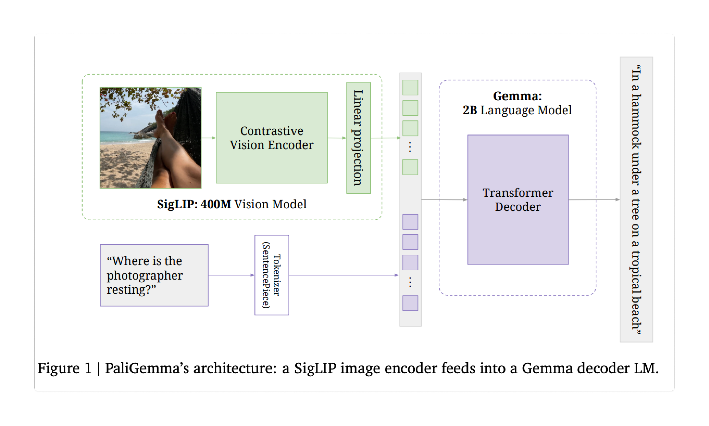
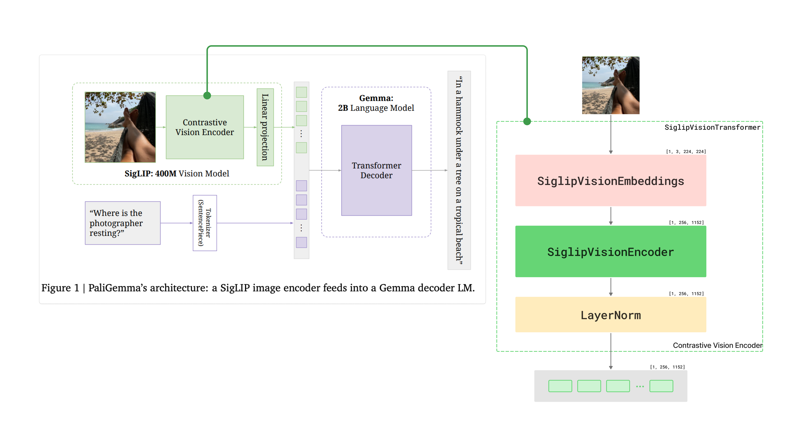
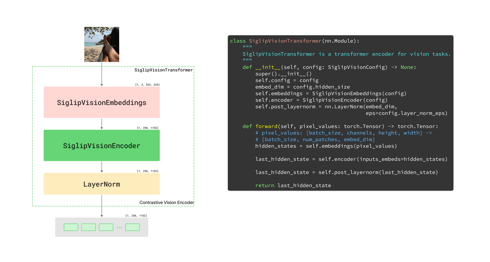
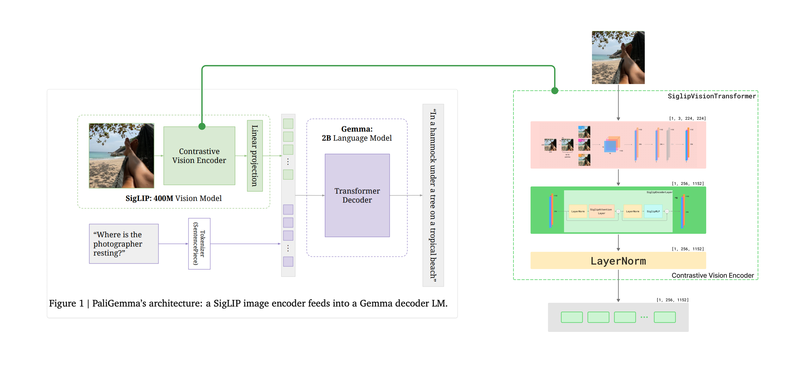
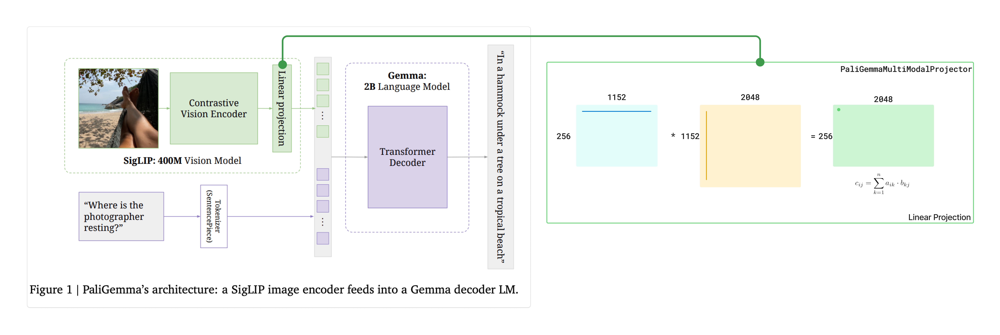
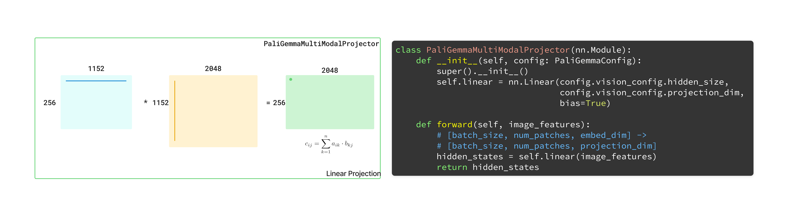

# Implementing PaliGemma From Scratch

A PyTorch implementation of PaliGemma, a lightweight multimodal model that combines vision and language understanding capabilities. 

This project implements the model architecture from scratch, providing detailed explanations and visualizations for each component.

## Table of Contents
- [Implementing PaliGemma From Scratch](#implementing-paligemma-from-scratch)
  - [Table of Contents](#table-of-contents)
  - [🌟 Introduction to PaliGemma](#-introduction-to-paligemma)
  - [🚀 The Implementation Journey](#-the-implementation-journey)
  - [🧩 Part 1: Understanding SigLIP](#-part-1-understanding-siglip)
    - [From CLIP to SigLIP: What's the Difference?](#from-clip-to-siglip-whats-the-difference)
    - [SigLIP Vision Transformer Architecture](#siglip-vision-transformer-architecture)
    - [Contrastive Vision Encoder Implementation](#contrastive-vision-encoder-implementation)
    - [SigLIP Vision Embeddings: Converting Images to Patch Embeddings](#siglip-vision-embeddings-converting-images-to-patch-embeddings)
    - [Implementation of SiglipVisionEmbeddings class](#implementation-of-siglipvisionembeddings-class)
    - [SigLIP Vision Encoder: Processing Visual Information](#siglip-vision-encoder-processing-visual-information)
    - [Implementation of SiglipVisionEncoder class](#implementation-of-siglipvisionencoder-class)
    - [SigLIP  Encoder Layer: The Building Block](#siglip--encoder-layer-the-building-block)
    - [Key Components of the Vision Encoder](#key-components-of-the-vision-encoder)
  - [⚙️ Part 2: Implementing the Gemma Language Model](#️-part-2-implementing-the-gemma-language-model)
    - [Understanding Gemma: Google's Efficient Language Model](#understanding-gemma-googles-efficient-language-model)
    - [Input Processing and Tokenization](#input-processing-and-tokenization)
    - [Implementing Transformer Decoder](#implementing-transformer-decoder)
    - [The Core of Gemma: GemmaModel Implementation](#the-core-of-gemma-gemmamodel-implementation)
    - [The Building Block: GemmaDecoderLayer](#the-building-block-gemmadecoderlayer)
    - [Key Architectural Elements of Gemma](#key-architectural-elements-of-gemma)
  - [📚 Resources](#-resources)
    - [Research Papers](#research-papers)

## 🌟 Introduction to PaliGemma



PaliGemma is a lightweight vision-language model (VLM) developed by Google. It consists of two main components:
- **Vision Encoder (SigLIP)**: A lightweight vision encoder that transforms images into meaningful embeddings
- **Language Decoder (Gemma)**: A lightweight language decoder that generates text based on inputs.

PaliGemma excels at tasks requiring both visual and textual understanding, such as:

- **Visual question answering (VQA)**: "What color is the car in this image?"
- **Image captioning**: Generating detailed descriptions of visual content
- **Visual reasoning**: "Which object in the image is larger?"
- **Following instructions with visual context**: "Describe what's in the top-right corner of this image"

## 🚀 The Implementation Journey

In this tutorial, we will dive into the implementation of SigLIP, Gemma and data preprocessing block to create a PaliGemma model from scratch. Gradually reviewing each building block of both:
-  SigLIP vision encoder  

- Gemma Transformer decoder.


At the end of this tutorial, we will load the weight of the trained PaliGamma model from HuggingFace and use it to generate text responses based on both the visual input and any textual prompts.

<!-- The SigLIP vision encoder processes images into embeddings, which are then passed to the Gemma language model to generate appropriate text responses based on both the visual input and any textual prompts. -->

So, without further ado, let's dive into the implementation of PaliGemma.

## 🧩 Part 1: Understanding SigLIP

SigLIP (Sigmoid Loss Image-text Pre-training) is a vision encoder used in PaliGemma that improves upon previous vision-language models like CLIP (Contrastive Language-Image Pre-training).

### From CLIP to SigLIP: What's the Difference?

Before SigLIP, CLIP was the standard approach. CLIP works by training an image encoder and a text encoder together, using a softmax loss over a large batch of (image, text) pairs. The idea is: the correct image-text pairs should be more similar to each other than to the rest of the batch. But to make this work, CLIP has to normalize over the entire batch — that’s computationally expensive and memory-heavy.

Here’s where SigLIP comes handy.

How SigLIP is Different:
- Loss Function: Instead of softmax, SigLIP uses sigmoid loss, which evaluates each image-text pair independently.
- No Full Batch Normalization: SigLIP doesn’t need to compute global similarities across the batch, making it lighter on memory and more scalable.
- More Stable with Smaller Batches: It performs better than CLIP when batch sizes are limited.
- Easier Distributed Training: Its design allows for more efficient multi-device training without large all-gather operations.

In PaliGemma, the SigLIP vision encoder extracts meaningful representations from images, which are then used by the Gemma language model to generate appropriate text responses. These representations capture both fine-grained details and higher-level semantic concepts in the image.

### SigLIP Vision Transformer Architecture

Let's dive into the architecture of the SigLIP Vision Transformer.


The SigLIP Vision Transformer (ViT) architecture consists of several key components:

1. **Vision Embeddings**: Converts the raw image into patch embeddings with positional information
2. **Encoder**: A stack of transformer layers that process the embedded image patches
3. **Post LayerNorm**: Normalizes the final output for improved stability
4. **Linear Projection**: Projects the hidden states from the Vision Encoder to a higher-dimensional space to match the dimension of the text embeddings

The first three components are implemented in the **SiglipVisionTransformer** class, while the last one is implemented in the **PaliGemmaMultiModalProjector** class.

### Contrastive Vision Encoder Implementation

Contrastive Vision Encoder is represented in a PaliGemma model by the **SiglipVisionTransformer** class, which is a simple wrapper around the **SiglipVisionEmbeddings**, **SiglipVisionEncoder** and **Post LayerNorm** components.

It takes raw pixel values as input and returns the final hidden states of shape [batch_size, num_patches, embed_dim], where num_patches is the number of patches in the image (256 patches for 224x224 image) and embed_dim is the dimension of the hidden states (1152 in PaliGemma).



Let's examine the code implementation of the **SiglipVisionTransformer** class:



```python
class SiglipVisionTransformer(nn.Module):
    def __init__(self, config: SiglipVisionConfig) -> None:
        super().__init__()
        self.config = config
        embed_dim = config.hidden_size
        self.embeddings = SiglipVisionEmbeddings(config)
        self.encoder = SiglipVisionEncoder(config)
        self.post_layernorm = nn.LayerNorm(embed_dim, eps=config.layer_norm_eps)

    def forward(self, pixel_values: torch.Tensor) -> torch.Tensor:
        # pixel_values: [batch_size, channels, height, width] -> [batch_size, num_patches, embed_dim]
        hidden_states = self.embeddings(pixel_values)

        last_hidden_state = self.encoder(inputs_embeds=hidden_states)

        last_hidden_state = self.post_layernorm(last_hidden_state)

        return last_hidden_state
```

### SigLIP Vision Embeddings: Converting Images to Patch Embeddings

Let's take a closer look at what is happening in the **SiglipVisionEmbeddings** class:


The **SiglipVisionEmbeddings** class is responsible for the first step in vision processing: converting a raw image into a sequence of contextualized embeddings for each patch that can be processed by the transformer encoder.

Let's break down what each component does in **SiglipVisionEmbeddings**:
   - Takes raw pixel values and converts them into patches of size `patch_size` (14×14 pixels each).
   - Uses a convolutional layer with stride equal to the patch size, so no overlapping between patches.
   - Flatterns the output to transform feature matrixes into vectors of embeddings.
   - Adds positional embeddings to preserve spatial information.
   - Output shape:  `[batch_size, num_patches, embed_dim]`.

### Implementation of SiglipVisionEmbeddings class


```python
class SiglipVisionEmbeddings(nn.Module):
    def __init__(self, config: SiglipVisionConfig) -> None:
        super().__init__()
        self.config = config
        self.embedding_dim = config.hidden_size
        self.image_size = config.image_size
        self.patch_size = config.patch_size

        self.patch_embedding = nn.Conv2d(
            in_channels=config.num_channels,
            out_channels=self.embedding_dim,
            kernel_size=self.patch_size,
            stride=self.patch_size, # so no overlap between patches
            padding=0,
        )
        
        self.num_patches = (self.image_size // self.patch_size) ** 2
        self.num_positions = self.num_patches
        self.position_embedding = nn.Embedding(self.num_positions, self.embedding_dim)
        self.register_buffer("position_ids", 
            torch.arange(self.num_positions).expand((1, -1)),
            persistent=False)

    def forward(self, pixel_values: torch.FloatTensor) -> torch.Tensor:
        _, _, H, W = pixel_values.shape # [batch_size, channels, H, W]
        # Convolve the `patch_size` kernel over the image, with no overlapping patches since 
        # the stride is equal to the kernel size
        # The output of the convolution will have shape [batch_size, embed_dim, num_patches_h, num_patches_w]
        # where num_patches_h = H // patch_size and num_patches_w = W // patch_size
        patch_embeds = self.patch_embedding(pixel_values)  
        # [batch_size, embed_dim, num_patches_h, num_patches_w] -> [batch_size, embed_dim, num_patches]
        # where num_patches = num_patches_h * num_patches_w
        embeddings = patch_embeds.flatten(2)
        # [batch_size, embed_dim, num_patches] -> [batch_size, num_patches, embed_dim]
        embeddings = embeddings.transpose(1, 2)
        # Add position embeddings to each patch. Each positional encoding is a vector of size [embed_dim]
        embeddings = embeddings + self.position_embedding(self.position_ids)
        # [batch_size, num_patches, embed_dim]
        return embeddings
```

The Vision Embeddings component effectively converts a 2D image into a 1D sequence of patch embeddings, similar to how words are embedded in NLP models, making it possible for the transformer encoder to process visual information.

### SigLIP Vision Encoder: Processing Visual Information

Next block after Vision Embeddings is Vision Encoder. 
After converting the image into contextualized embeddings, the SigLIP Vision Encoder processes this information through a series of transformer layers. Each transformer layer contains self-attention and feed-forward network blocks with residual connections, implemented in the **SiglipEncoderLayer** class. All together, these create the **SiglipVisionEncoder** class which forms the computational core of the vision understanding system. The dim of tensors is preserved in each layer.

The encoder's job can be thought of as creating a "visual understanding" of the image - transforming raw pixel representations into semantic concepts that can be aligned with language.


Note that SigLIP uses a "pre-norm" architecture (normalizing before attention and MLP) rather than "post-norm" (which was common in earlier transformers). 

### Implementation of SiglipVisionEncoder class


```python
class SiglipVisionEncoder(nn.Module):
    def __init__(self, config: SiglipVisionConfig):
        super().__init__()
        self.config = config
        self.layers = nn.ModuleList(
            [SiglipEncoderLayer(config) for _ in range(config.num_hidden_layers)]
        )

    def forward(
        self,
        inputs_embeds: torch.Tensor
    ) -> torch.Tensor:
        # inputs_embeds: [batch_size, num_patches, embed_dim]
        hidden_states = inputs_embeds

        for encoder_layer in self.layers:
            # [batch_size, num_patches, embed_dim] -> [batch_size, num_patches, embed_dim]
            hidden_states = encoder_layer(hidden_states)

        return hidden_states
```
In **SiglipVisionEncoder** class forward method, we define a series of **SiglipEncoderLayer** objects, which are stacked together to form the encoder, where output of the previous layer is passed as input to the next layer. It repeats N times, where N is the number of hidden layers, defined in the config.json file. In Paligemma, it's 27.


### SigLIP  Encoder Layer: The Building Block

In this section, I will not dive deeper into the visualization of Attention mechanism as it is a very popular topic and there are many resources available online.

SiglipMLP is a simple multi-layer perceptron (MLP) that applies a feed-forward network to the hidden states. It consists of two linear layers with a GELU activation function in between. This component is essential for introducing non-linearity into the model and allowing it to learn complex functions beyond what attention alone can provide. 

Let's implement the **SiglipEncoderLayer** class.


```python
class SiglipEncoderLayer(nn.Module):
    def __init__(self, config: SiglipVisionConfig):
        super().__init__()
        self.embed_dim = config.hidden_size
        self.self_attn = SiglipAttention(config)
        self.layer_norm1 = nn.LayerNorm(self.embed_dim, eps=config.layer_norm_eps)
        self.mlp = SiglipMLP(config)
        self.layer_norm2 = nn.LayerNorm(self.embed_dim, eps=config.layer_norm_eps)

    def forward(self, hidden_states: torch.Tensor) -> torch.Tensor:
        # Apply self-attention with residual connection
        residual = hidden_states
        hidden_states = self.layer_norm1(hidden_states)
        hidden_states, _ = self.self_attn(hidden_states=hidden_states)
        hidden_states = residual + hidden_states
        
        # Apply MLP with residual connection
        residual = hidden_states
        hidden_states = self.layer_norm2(hidden_states)
        hidden_states = self.mlp(hidden_states)
        hidden_states = residual + hidden_states
        
        return hidden_states
```

### Key Components of the Vision Encoder

1. **Multiple Encoder Layers**:
   - The encoder consists of a stack of identical transformer layers (27 layers in this case)
   - Each layer further refines the representation of the image
   - Information flows sequentially through the layers

2. **Each Encoder Layer Contains**:
   - **Self-Attention Mechanism**: Allows patches to attend to all other patches
   - **Layer Normalization**: Applied before attention and MLP for stable training
   - **Feed-Forward Network (MLP)**: Applies non-linear transformations to patch representations
   - **Residual Connections**: Help information flow and enable training of deep networks

3. **Self-Attention Operation**:
   - Calculates the relationships between all pairs of patches. No need to use mask attention, since we need to capture the relationships between all pairs of patches (unlike in NLP, where we capture the relationships of each token to previous tokens and not the following tokens).
   - Helps the model understand which parts of the image are related to each other
   - Crucial for capturing long-range dependencies in the image

4. **MLP Block**:
   - Consists of two linear transformations with a GELU activation in between
   - Increases the model's capacity to learn complex functions
   - Expands the dimension to about 4x(1152 -> 4304) the embedding dimension before projecting back.

The Vision Encoder effectively processes the relationships between different parts of an image, allowing the model to understand complex visual patterns and structures. The self-attention mechanism is particularly powerful as it enables each patch to gather information from all other patches, regardless of their spatial distance in the original image.

Quick recap of the Vision Encoder that we already implemented:


Next block in SigLIP architecture is Linear Projection. 
This block projects the hidden states from the Vision Encoder to a higher-dimensional space to match the dimension of the text embeddings.



Simply put, it's a single linear layer which is a simple matrix multiplication operation.



```python

class PaliGemmaMultiModalProjector(nn.Module):
    def __init__(self, config: PaliGemmaConfig):
        super().__init__()
        self.config = config
        self.projector = nn.Linear(config.hidden_size, config.hidden_size)

    def forward(self, hidden_states: torch.Tensor) -> torch.Tensor:
        # hidden_states: [batch_size, num_patches, embed_dim]
        hidden_states = self.projector(hidden_states)
        return hidden_states
```

**PaliGemmaMultiModalProjector** used in **PaliGemmaForConditionalGeneration** which prepares the input text embeddings and image embeddings for the Gemma language model.


Now, putting it all together, we have gone through the entire Siglip architecture and implemented it in PyTorch. Take a detailed look at the Siglip architecture below.
We took an image as an input ([1, 3, 224, 244]), passed it through the SiglipVisionEmbeddings to project it into a high-dimensional space, then passed it through the SiglipVisionEncoder to process the image information through a series of transformer layers. The output of the Vision Encoder is then passed through the PaliGemmaMultiModalProjector to project it into the same space as the text embeddings. The final output is a tensor of shape [1, 256, 2048].


## ⚙️ Part 2: Implementing the Gemma Language Model

### Understanding Gemma: Google's Efficient Language Model

Gemma is an open-source, lightweight language model family developed by Google.


Key characteristics of Gemma include:

1. **Efficient Architecture**: Optimized for lower computational requirements without sacrificing significant performance
2. **Open Weights**: Fully open-source model weights, enabling widespread research and customization
3. **Strong Foundation**: Built on the same research foundation as the more powerful Gemini models
4. **Multiple Sizes**: Available in 2B and 7B parameter versions (PaliGemma uses the 2B variant)
5. **Decoder-Only Design**: Uses a transformer decoder-only architecture, focusing on text generation rather than bidirectional understanding

In the PaliGemma architecture, Gemma-2B serves as the language generation component. It receives two types of inputs:

1. **Image Tokens**: The processed output from the SigLIP vision encoder, after being projected to match the language model's embedding dimension
2. **Text Tokens**: The tokenized text input (prefixes for prompting)

The model processes a carefully structured sequence:
```
tokens = [image tokens..., BOS, prefix tokens..., EOS, PAD...]
```

For details on the transformation of the input, check **PaliGemmaForConditionalGeneration** class. 
```python
class PaliGemmaForConditionalGeneration(nn.Module):
    def __init__(self, config: PaliGemmaConfig):
        super().__init__()
        self.config = config
        self.vision_tower = SiglipVisionModel(config.vision_config) # image encoder
        # a linear layer that converts the size of the embeding output from visual encoder 
        # into the size of the embeding of each token, so they can be concatenated together
        self.multi_modal_projector = PaliGemmaMultiModalProjector(config) 
        self.vocab_size = config.vocab_size

        language_model = GemmaForCausalLM(config.text_config)
        self.language_model = language_model

        self.pad_token_id = self.config.pad_token_id if self.config.pad_token_id is not None else -1

    def tie_weights(self):
        return self.language_model.tie_weights()

    def _merge_input_ids_with_image_features(
        self, image_features: torch.Tensor, inputs_embeds: torch.Tensor, input_ids: torch.Tensor, attention_mask: torch.Tensor, kv_cache: Optional[KVCache] = None
    ):
        # ... check at modeling_gemma.py
        return final_embedding, causal_mask, position_ids

    def forward(
        self,
        input_ids: torch.LongTensor = None,
        pixel_values: torch.FloatTensor = None,
        attention_mask: Optional[torch.Tensor] = None,
        kv_cache: Optional[KVCache] = None,
    ) -> Tuple:

        # Make sure the input is right-padded
        assert torch.all(attention_mask == 1), "The input cannot be padded"

        # 1. Extract the input embeddings
        # shape: (batch_size, seq_len, hidden_size)
        # seq_len = number of image patches +1 for <bos> token + number of text tokens + 1 for "/n" token
        inputs_embeds = self.language_model.get_input_embeddings()(input_ids)

        # 2. Merge text and images
        # [batch_size, channels, height, width] -> [batch_size, num_patches, embed_dim]
        selected_image_feature = self.vision_tower(pixel_values.to(inputs_embeds.dtype))
        # [batch_size, num_patches, embed_dim] -> [batch_size, num_patches, hidden_size]
        image_features = self.multi_modal_projector(selected_image_feature)

        # Merge the embeddings of the text tokens and the image tokens
        inputs_embeds, attention_mask, position_ids = self._merge_input_ids_with_image_features(image_features, 
                                                                                               inputs_embeds, 
                                                                                               input_ids, 
                                                                                               attention_mask, 
                                                                                               kv_cache)
        # 3. Feed the merged embeddings into the language model
        outputs = self.language_model(
            attention_mask=attention_mask,
            position_ids=position_ids,
            inputs_embeds=inputs_embeds,
            kv_cache=kv_cache,
        )
        return outputs
```
### Input Processing and Tokenization

The `preprocessing_paligemma.py` file reveals how inputs are processed before being fed to the model:

1. **Special Image Token**:
   - PaliGemma uses a special `<image>` token to represent visual information
   - This token is repeated for each "patch" of the image (256 tokens in this case)

2. **Token Sequence Format**:
   - Inputs are structured as: `[image_tokens, BOS, text_tokens, newline]`
   - The newline (`\n`) is an important part of the input format that the model was trained with

3. **Extended Vocabulary**:
   - PaliGemma includes special tokens for object detection and segmentation:
     ```python
     EXTRA_TOKENS = [f"<loc{i:04d}>" for i in range(1024)]  # For bounding boxes
     EXTRA_TOKENS += [f"<seg{i:03d}>" for i in range(128)]  # For segmentation
     ```

4. **Image Processing**:
   - Images are resized, normalized, and converted to the expected format:
     ```python
     # Normalize with mean=0.5 and std=0.5 for each channel
     images = [normalize(image, mean=IMAGENET_STANDARD_MEAN, std=IMAGENET_STANDARD_STD) for image in images]
     # Convert to [Channels, Height, Width] format
     images = [image.transpose(2, 0, 1) for image in images]
     ```


For simplicity, during inference we typically process one image and text at a time, so padding tokens are not a concern. For the purpose of this tutorial, the input is [1, seq_len, embed_dim].


### Implementing Transformer Decoder


Simply put, **GemmaForCasualLM** class is the implementation of Transformer Decoder from the paligemma architecture.
It consists of a chain of transformer decoder layers, each containing attention and feed-forward network blocks with residual connections, implemented in the **GemmaDecoderLayer** class. After stacking **GemmaDecoderLayer** classes N times (in this case, 18 times) and adding RMS normalization, we get the **GemmaModel** class. Final linear layer is added to convert the hidden states to logits, followed by a softmax function to get the final output.

Now let's look at the code implementation:


```python
class GemmaForCausalLM(nn.Module):

    def __init__(self, config):
        super().__init__()
        self.config = config
        self.model = GemmaModel(config)
        self.vocab_size = config.vocab_size
        self.lm_head = nn.Linear(config.hidden_size, config.vocab_size, bias=False)

    def get_input_embeddings(self):
        return self.model.embed_tokens
    
    def tie_weights(self):
        self.lm_head.weight = self.model.embed_tokens.weight

    def forward(
        self,
        attention_mask: Optional[torch.Tensor] = None,
        position_ids: Optional[torch.LongTensor] = None,
        inputs_embeds: Optional[torch.FloatTensor] = None,
        kv_cache: Optional[KVCache] = None,
    ) -> Tuple:

        # input_embeds: [batch_size, seq_len, hidden_size]
        # outputs: [batch_size, seq_len, hidden_size]
        outputs = self.model(
            attention_mask=attention_mask,
            position_ids=position_ids,
            inputs_embeds=inputs_embeds,
            kv_cache=kv_cache,
        )

        hidden_states = outputs
        logits = self.lm_head(hidden_states)
        logits = logits.float()

        return_data = {
            "logits": logits,
        }

        if kv_cache is not None:
            # Return the updated cache
            return_data["kv_cache"] = kv_cache

        return return_data

```


### The Core of Gemma: GemmaModel Implementation


```python
class GemmaModel(nn.Module):
    def __init__(self, config: GemmaConfig):
        super().__init__()
        self.config = config
        self.padding_idx = config.pad_token_id
        self.vocab_size = config.vocab_size

        # Token embedding layer - converts token IDs to vectors
        self.embed_tokens = nn.Embedding(config.vocab_size, config.hidden_size, self.padding_idx)
        
        # Stack of transformer decoder layers
        self.layers = nn.ModuleList(
            [GemmaDecoderLayer(config, layer_idx) for layer_idx in range(config.num_hidden_layers)]
        )
        
        # Final normalization layer
        self.norm = GemmaRMSNorm(config.hidden_size, eps=config.rms_norm_eps)

    def forward(
            self,
            attention_mask: Optional[torch.Tensor] = None,
            position_ids: Optional[torch.LongTensor] = None,
            inputs_embeds: Optional[torch.FloatTensor] = None,
            kv_cache: Optional[KVCache] = None,
        ):
        # Pass embeddings through the decoder layers
        hidden_states = inputs_embeds
        
        # Generate position IDs if not provided
        if position_ids is None:
            position_ids = self.generate_position_ids(attention_mask)
        
        # Process through each decoder layer
        for decoder_layer in self.layers:
            hidden_states = decoder_layer(
                hidden_states,
                attention_mask=attention_mask,
                position_ids=position_ids,
                kv_cache=kv_cache,
            )
        
        # Apply final normalization
        hidden_states = self.norm(hidden_states)
        
        return hidden_states
```

The `GemmaModel` serves as the backbone of the language processing capabilities in PaliGemma. It takes token embeddings (which includes both image and text embeddings) and processes them through a series of transformer decoder layers, finally applying a normalization layer before outputting the processed hidden states.

### The Building Block: GemmaDecoderLayer

Each decoder layer in the Gemma architecture consists of Grouped-Query Attention and Feed-Forward Network components with specialized modifications:


```python
class GemmaDecoderLayer(nn.Module):
    def __init__(self, config: GemmaConfig, layer_idx: int):
        super().__init__()
        self.hidden_size = config.hidden_size

        # Self-attention mechanism
        self.self_attn = GemmaAttention(config=config, layer_idx=layer_idx)

        # Feed-forward network (MLP)
        self.mlp = GemmaMLP(config)
        
        # Normalization layers
        self.input_layernorm = GemmaRMSNorm(config.hidden_size, eps=config.rms_norm_eps)
        self.post_attention_layernorm = GemmaRMSNorm(config.hidden_size, eps=config.rms_norm_eps)

    def forward(
            self,
            hidden_states: torch.Tensor,
            attention_mask: Optional[torch.Tensor] = None,
            position_ids: Optional[torch.LongTensor] = None,
            kv_cache: Optional[KVCache] = None,
        ):
        # Apply first normalization layer
        residual = hidden_states
        hidden_states = self.input_layernorm(hidden_states)
        
        # Apply self-attention
        hidden_states = self.self_attn(
            hidden_states=hidden_states,
            attention_mask=attention_mask,
            position_ids=position_ids,
            kv_cache=kv_cache,
        )[0]
        
        # First residual connection
        hidden_states = residual + hidden_states
        
        # Apply second normalization layer
        residual = hidden_states
        hidden_states = self.post_attention_layernorm(hidden_states)
        
        # Apply MLP
        hidden_states = self.mlp(hidden_states)
        
        # Second residual connection
        hidden_states = residual + hidden_states
        
        return hidden_states
```

### Key Architectural Elements of Gemma

1. **Pre-Normalization Architecture**:
   - Unlike some earlier transformer models, Gemma uses a pre-normalization approach (applying normalization before attention and MLP)
   - This design choice improves training stability, especially for deeper models

2. **RMSNorm**:
   - Gemma uses Root Mean Square Layer Normalization (RMSNorm) instead of traditional LayerNorm
   - RMSNorm is more computationally efficient and helps stabilize training
   - The implementation includes a normalization parameter with a +1 offset for numerical stability:
     ```python
     output = output * (1.0 + self.weight.float())
     ```

3. **Rotary Position Embeddings (RoPE)**:
   - Instead of absolute positional embeddings, Gemma uses rotary position embeddings
   - This enables better generalization to sequence lengths not seen during training
   - The implementation applies a rotation to the query and key vectors in attention:
     ```python
     query_states, key_states = apply_rotary_pos_emb(query_states, key_states, cos, sin)
     ```

4. **Grouped-Query Attention (GQA)**:
   - Gemma implements a variant of multi-head attention called Grouped-Query Attention
   - GQA reduces computational requirements by using fewer key-value heads than query heads
   - This is implemented through the `repeat_kv` function, which repeats key and value heads to match query heads:
     ```python
     key_states = repeat_kv(key_states, self.num_key_value_groups)
     value_states = repeat_kv(value_states, self.num_key_value_groups)
     ```


Putting it all together, we have gone through the entire Gemma architecture and implemented it in PyTorch. Take a detailed look at the Gemma architecture below.


By integrating these sophisticated components, PaliGemma achieves remarkable multimodal capabilities, effectively connecting visual perception with language understanding and generation. The careful design of both the vision and language components, along with their integration, enables the model to process and reason about visual information in natural language.


## 📚 Resources

### Research Papers
- [PaliGemma: A versatile 3B VLM for multimodal tasks](https://arxiv.org/pdf/2407.07726)
- [SigLIP: A Lightweight Vision Encoder](https://arxiv.org/pdf/2303.15343)
- [Gemma: Open Models Based on Gemini](https://arxiv.org/pdf/2403.08295)
- [PaliGemma 2: Family of Versatile VLMs for Transfer](https://arxiv.org/pdf/2412.03555)
- [SigLIP 2: Multilingual Vision-Language Encoders with Improved Semantic Understanding, Localization, and Dense Features](https://arxiv.org/pdf/2502.14786)
- [Gemma 2: Improving Open Language Models at a Practical Size](https://arxiv.org/pdf/2408.00118)    
- [Gemma 3 Technical Report](https://arxiv.org/pdf/2503.19786)